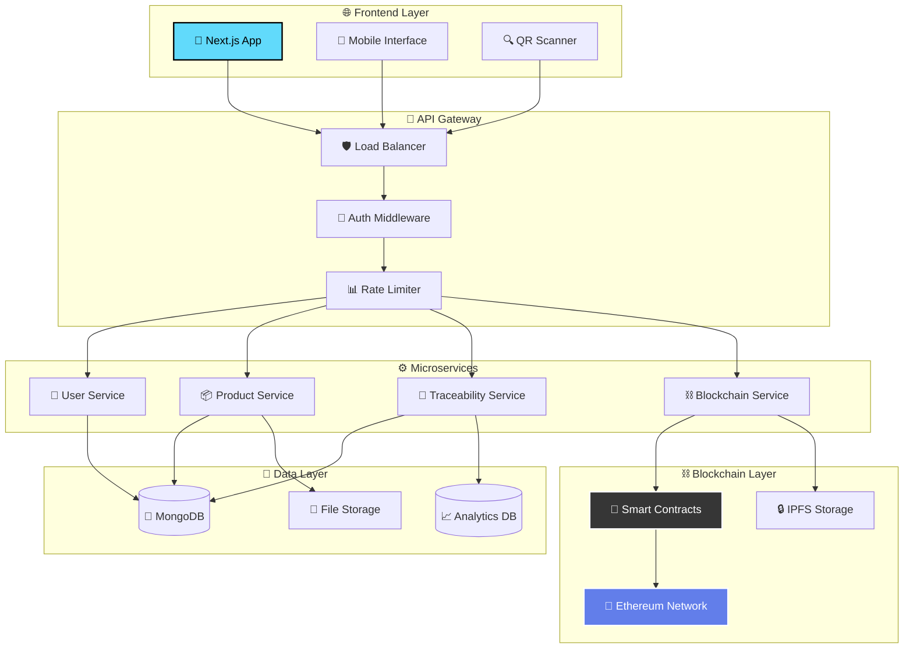

# 🥗 FoodTrace - Revolutionary Food Traceability System

<div align="center">
  
</div>

<div align="center">
  
</div>

<div align="center">
  
</div>

---

## 🌟 **MISSION STATEMENT**

<div align="center">
  <table>
    <tr>
      <td>
        
      </td>
      <td>
        <h3>🎯 TRANSFORMING FOOD SAFETY</h3>
        <p><em>Revolutionizing global food supply chains through cutting-edge blockchain technology, ensuring transparency, authenticity, and safety from farm to consumer.</em></p>
      </td>
      <td>
        
      </td>
    </tr>
  </table>
</div>

---

## 🏆 **TECHNOLOGY POWERHOUSE**

<div align="center">
  
</div>

<div align="center">
  
  
  
  
</div>

<div align="center">
  
  
  
  
</div>

---

## 🚀 **REVOLUTIONARY FEATURES**

<div align="center">
  
</div>

<table align="center" width="100%">
<tr>
<td width="33%" align="center">
  
  <h3>🔗 BLOCKCHAIN IMMUTABILITY</h3>
  <p>• Tamper-proof transaction records<br>
  • Smart contract automation<br>
  • Decentralized security<br>
  • Real-time consensus</p>
</td>
<td width="33%" align="center">
  
  <h3>📱 INSTANT VERIFICATION</h3>
  <p>• QR code integration<br>
  • Mobile-first design<br>
  • Real-time tracking<br>
  • Instant authenticity</p>
</td>
<td width="33%" align="center">
  
  <h3>📊 ADVANCED ANALYTICS</h3>
  <p>• Live dashboard insights<br>
  • Predictive analytics<br>
  • Supply chain optimization<br>
  • Performance metrics</p>
</td>
</tr>
</table>

---

## 🏗️ **SYSTEM ARCHITECTURE**

<div align="center">
  
</div>



---

## 📁 **PROJECT STRUCTURE**

<details>
<summary>🗂️ <strong>DETAILED ARCHITECTURE BREAKDOWN</strong></summary>

```
🏢 FoodTrace Enterprise Suite
├── 🎨 frontend/                          # Next.js 14 Application
│   ├── 🧩 src/
│   │   ├── 📄 app/                       # App Router (Next.js 13+)
│   │   │   ├── 🏠 (dashboard)/           # Dashboard routes
│   │   │   ├── 🔐 auth/                  # Authentication pages
│   │   │   ├── 📱 mobile/                # Mobile-specific routes
│   │   │   └── 🔍 scanner/               # QR Scanner interface
│   │   ├── 🧩 components/
│   │   │   ├── 🎨 ui/                    # Reusable UI components
│   │   │   ├── 📊 charts/                # Data visualization
│   │   │   ├── 📱 mobile/                # Mobile components
│   │   │   └── 🔍 scanner/               # QR Scanner components
│   │   ├── 🔗 hooks/                     # Custom React hooks
│   │   ├── 🛠️ lib/                       # Utility libraries
│   │   ├── 🎨 styles/                    # Global styles & themes
│   │   └── 🔧 utils/                     # Helper functions
│   ├── 📁 public/                        # Static assets
│   └── ⚙️ Configuration files
│
├── 🚀 backend/                           # Node.js Microservices
│   ├── 🔐 auth-service/                  # Authentication service
│   ├── 👤 user-service/                  # User management
│   ├── 📦 product-service/               # Product management
│   ├── 🔗 traceability-service/          # Supply chain tracking
│   ├── ⛓️ blockchain-service/            # Web3 integration
│   ├── 📊 analytics-service/             # Data analytics
│   ├── 🔍 scanner-service/               # QR code processing
│   └── 🌐 api-gateway/                   # Central API gateway
│
├── ⛓️ blockchain/                        # Smart Contract Suite
│   ├── 📜 contracts/
│   │   ├── 🏭 SupplyChain.sol           # Main supply chain contract
│   │   ├── 📦 Product.sol               # Product NFT contract
│   │   ├── 👤 Identity.sol              # Identity management
│   │   └── 🔐 AccessControl.sol         # Permission system
│   ├── 🧪 test/                         # Comprehensive test suite
│   ├── 📋 scripts/                      # Deployment & utility scripts
│   ├── 🔧 migrations/                   # Contract migrations
│   └── ⚙️ Configuration files
│
├── 📱 mobile/                           # React Native App (Future)
│   ├── 🎨 src/
│   ├── 📁 assets/
│   └── ⚙️ Configuration files
│
├── 🔧 infrastructure/                   # DevOps & Infrastructure
│   ├── 🐳 docker/                      # Docker configurations
│   ├── ☁️ aws/                         # AWS infrastructure
│   ├── 🔄 ci-cd/                       # CI/CD pipelines
│   └── 📊 monitoring/                  # Monitoring & logging
│
└── 📚 docs/                            # Documentation
    ├── 📖 api/                         # API documentation
    ├── 🏗️ architecture/                # System architecture
    ├── 🚀 deployment/                  # Deployment guides
    └── 👥 user-guides/                 # User manuals
```

</details>

---

## ⚡ **QUICK START GUIDE**

<div align="center">
  
</div>

### 📋 **SYSTEM REQUIREMENTS**

<div align="center">
  <table>
    <tr>
      <th>🛠️ Component</th>
      <th>📦 Version</th>
      <th>🎯 Status</th>
      <th>📝 Notes</th>
    </tr>
    <tr>
      <td> Node.js</td>
      <td>≥ 18.0.0</td>
      <td>✅ Critical</td>
      <td>LTS Recommended</td>
    </tr>
    <tr>
      <td> npm/yarn</td>
      <td>Latest</td>
      <td>✅ Critical</td>
      <td>Package Manager</td>
    </tr>
    <tr>
      <td> Docker</td>
      <td>≥ 20.0.0</td>
      <td>✅ Critical</td>
      <td>Containerization</td>
    </tr>
    <tr>
      <td> MongoDB</td>
      <td>≥ 6.0.0</td>
      <td>🔧 Development</td>
      <td>Database</td>
    </tr>
    <tr>
      <td>⛓️ Ganache</td>
      <td>Latest</td>
      <td>🧪 Testing</td>
      <td>Local Blockchain</td>
    </tr>
  </table>
</div>

### 🚀 **ONE-CLICK DEPLOYMENT**

<div align="center">
  
</div>

```bash
# 🏗️ INFRASTRUCTURE SETUP
git clone https://github.com/your-username/foodtrace.git
cd foodtrace

# 🐳 DOCKER COMPOSE DEPLOYMENT
docker-compose up -d

# 🎯 QUICK ACCESS URLS
echo "🌐 Frontend: http://localhost:3000"
echo "🔧 Admin: http://localhost:3000/admin" 
echo "📊 API Docs: http://localhost:8000/docs"
echo "⛓️ Blockchain: http://localhost:7545"
```

<details>
<summary>🔧 <strong>MANUAL SETUP (ADVANCED)</strong></summary>

#### 1️⃣ **DATABASE INITIALIZATION**
```bash
# MongoDB with Docker
docker run -d \
  --name foodtrace-mongo \
  -p 27017:27017 \
  -e MONGO_INITDB_ROOT_USERNAME=admin \
  -e MONGO_INITDB_ROOT_PASSWORD=admin123 \
  -v foodtrace-data:/data/db \
  mongo:7.0
```

#### 2️⃣ **BLOCKCHAIN DEPLOYMENT**
```bash
cd blockchain
npm install
npm run compile
npm run migrate
python app.py
```

#### 3️⃣ **BACKEND SERVICES**
```bash
cd backend
npm install
npm run dev
```

#### 4️⃣ **FRONTEND APPLICATION**
```bash
cd frontend
npm install
npm run dev
```

</details>

### 🎯 **ACCESS POINTS**

<div align="center">
  <table>
    <tr>
      <th>🌐 Service</th>
      <th>🔗 URL</th>
      <th>👤 Credentials</th>
      <th>📝 Description</th>
    </tr>
    <tr>
      <td>🏠 <strong>Homepage</strong></td>
      <td><a href="http://localhost:3000">localhost:3000</a></td>
      <td>Public Access</td>
      <td>QR Scanner & Info</td>
    </tr>
    <tr>
      <td>🔧 <strong>Admin Panel</strong></td>
      <td><a href="http://localhost:3000/admin">localhost:3000/admin</a></td>
      <td>admin@gmail.com / admin123</td>
      <td>System Management</td>
    </tr>
    <tr>
      <td>📊 <strong>Dashboard</strong></td>
      <td><a href="http://localhost:3000/login">localhost:3000/login</a></td>
      <td>Supplier Accounts</td>
      <td>Product Management</td>
    </tr>
    <tr>
      <td>📖 <strong>API Docs</strong></td>
      <td><a href="http://localhost:8000/docs">localhost:8000/docs</a></td>
      <td>Public Access</td>
      <td>API Documentation</td>
    </tr>
  </table>
</div>

---

## 🎨 **USER EXPERIENCE SHOWCASE**

<div align="center">
  
</div>

### 📱 **MULTI-PLATFORM INTERFACE**

<table align="center">
<tr>
<td width="25%" align="center">
  
  <h4>🌐 WEB DASHBOARD</h4>
  <p><em>Comprehensive admin interface with real-time analytics and supply chain management</em></p>
</td>
<td width="25%" align="center">
  
  <h4>📱 MOBILE APP</h4>
  <p><em>Native iOS/Android app for suppliers and consumers with QR scanning capabilities</em></p>
</td>
<td width="25%" align="center">
  
  <h4>🔍 QR SCANNER</h4>
  <p><em>Instant product verification and traceability information access</em></p>
</td>
<td width="25%" align="center">
  
  <h4>⛓️ BLOCKCHAIN</h4>
  <p><em>Decentralized data storage ensuring transparency and immutability</em></p>
</td>
</tr>
</table>

---

## 🔧 **ADVANCED FEATURES**

<div align="center">
  
</div>

### 🏭 **SUPPLY CHAIN MANAGEMENT**

<table align="center" width="100%">
<tr>
<td width="50%">

#### 🌱 **FARM TO FORK TRACKING**
- 📍 **GPS Location Tracking** - Real-time location updates
- 🌡️ **Temperature Monitoring** - Cold chain compliance
- 📦 **Batch Management** - Lot tracking and recalls
- 🔄 **Status Updates** - Automated workflow triggers
- 📊 **Quality Metrics** - Continuous quality assessment

#### 🔐 **SECURITY & COMPLIANCE**
- 🛡️ **End-to-End Encryption** - Data protection
- 🔑 **Multi-Factor Authentication** - Enhanced security
- 📋 **Regulatory Compliance** - Industry standards
- 🔍 **Audit Trails** - Complete transaction history
- 🚨 **Fraud Detection** - AI-powered monitoring

</td>
<td width="50%">

#### 📊 **ANALYTICS & INSIGHTS**
- 📈 **Predictive Analytics** - Demand forecasting
- 🎯 **Performance KPIs** - Key performance indicators
- 📱 **Real-time Dashboards** - Live data visualization
- 📊 **Custom Reports** - Tailored business intelligence
- 🔔 **Smart Alerts** - Proactive notifications

#### 🌐 **INTEGRATION CAPABILITIES**
- 🔗 **ERP Integration** - Enterprise resource planning
- 📦 **IoT Connectivity** - Sensor data integration
- 🤖 **API Ecosystem** - Third-party integrations
- ☁️ **Cloud Scalability** - Auto-scaling infrastructure
- 🔄 **Webhook Support** - Real-time event triggers

</td>
</tr>
</table>

---

## 👥 **ELITE DEVELOPMENT TEAM**

<div align="center">
  
</div>

<div align="center">
  
</div>

<table align="center" width="100%">
<tr>
<td align="center" width="20%">
  
  <br><br>
  <h3>🎨 kuveee</h3>
  <p><strong>Frontend Architect</strong></p>
  <p>
    
  </p>
  <p><em>UI/UX Design • Component Architecture • Performance Optimization</em></p>
  <a href="https://github.com/kuveee">
    
  </a>
</td>
<td align="center" width="20%">
  
  <br><br>
  <h3>⛓️ NTK1100</h3>
  <p><strong>Blockchain Engineer</strong></p>
  <p>
    
  </p>
  <p><em>Smart Contracts • DeFi Protocols • Web3 Integration</em></p>
  <a href="https://github.com/NTK1100">
    
  </a>
</td>
<td align="center" width="20%">
  
  <br><br>
  <h3>🚀 zh13u</h3>
  <p><strong>Backend Specialist</strong></p>
  <p>
    
  </p>
  <p><em>Microservices • API Design • Database Architecture</em></p>
  <a href="https://github.com/zh13u">
    
  </a>
</td>
<td align="center" width="20%">
  
  <br><br>
  <h3>⚡ stepToBecomeGigachad</h3>
  <p><strong>Blockchain Developer</strong></p>
  <p>
    
  </p>
  <p><em>Smart Contracts • Testing • Deployment</em></p>
  <a href="https://github.com/stepToBecomeGigachad">
    
  </a>
</td>
<td align="center" width="20%">
  
  <br><br>
  <h3>🔧 Crabs536</h3>
  <p><strong>Backend Engineer</strong></p>
  <p>
    
  </p>
  <p><em>API Development • Database Design • DevOps</em></p>
  <a href="https://github.com/Crabs536">
    
  </a>
</td>
</tr>
</table>

### 🎯 **TEAM EXPERTISE MATRIX**

<div align="center">
  <table>
    <tr>
      <th>🏷️ <strong>ROLE</strong></th>
      <th>🎯 <strong>CORE RESPONSIBILITIES</strong></th>
      <th>🛠️ <strong>TECH STACK</strong></th>
      <th>📊 <strong>EXPERTISE LEVEL</strong></th>
    </tr>
    <tr>
      <td><strong>🎨 Frontend Architect</strong></td>
      <td>UI/UX Design, Component Library, Performance</td>
      <td>React, Next.js, TypeScript, Tailwind</td>
      <td></td>
    </tr>
    <tr>
      <td><strong>⛓️ Blockchain Engineer</strong></td>
      <td>Smart Contracts, DeFi Integration, Security</td>
      <td>Solidity, Ethereum, Truffle, Hardhat</td>
      <td></td>
    </tr>
    <tr>
      <td><strong>🚀 Backend Specialist</strong></td>
      <td>Microservices, API Gateway, Database Design</td>
      <td>Node.js, Express, MongoDB, Docker</td>
      <td></td>
    </tr>
    <tr>
      <td><strong>⚡ Blockchain Developer</strong></td>
      <td>Smart Contract Testing, Deployment, Optimization</td>
      <td>Solidity, JavaScript, Testing Frameworks</td>
      <td></td>
    </tr>
    <tr>
      <td><strong>🔧 Backend Engineer</strong></td>
      <td>API Development, Infrastructure, DevOps</td>
      <td>Node.js, Cloud Services, CI/CD</td>
      <td></td>
    </tr>
  </table>
</div>

---

## 🤝 **CONTRIBUTION GUIDELINES**

<div align="center">
  <img src="https://readme-typing-svg.herokuapp.com?font=Orbitron&size=30&duration=2000&pause=1000&color=4ECDC4&center=true&vCenter=true&width=800&lines=
